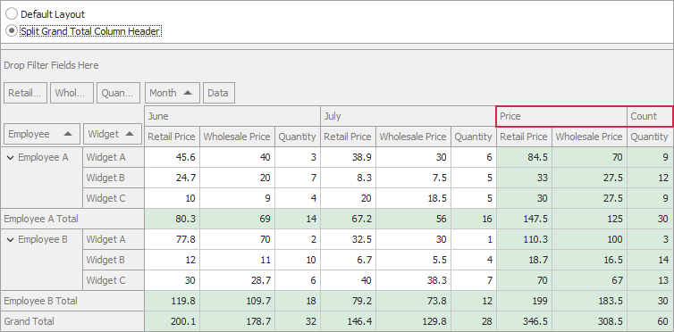

<!-- default badges list -->

<!-- default badges end -->

# Pivot Grid for WinForms - Split Field Value Cells

The following example demonstrates how to split field value cells. In this example, the Grand Total column header is split into two cells: _Price_ and _Count_. 

Handle the [CustomFieldValueCells](https://docs.devexpress.com/WindowsForms/DevExpress.XtraPivotGrid.PivotGridControl.CustomFieldValueCells) event and call the event parameter's [Split](https://docs.devexpress.com/CoreLibraries/DevExpress.XtraPivotGrid.PivotCustomFieldValueCellsEventArgsBase-2.Split(Boolean--Predicate-T2---IList-FieldValueSplitData-)) method. Cells that should be split are identified by a predicate that returns true for those cells. The quantity, size, and captions of newly created cells are specified by an array of cell definitions (the FieldValueSplitData objects).

## Files to Review

* [Data.cs](./CS/Data.cs) (VB: [Data.vb](./VB/Data.vb))
* [Form1.cs](./CS/Form1.cs) (VB: [Form1.vb](./VB/Form1.vb))
* [Program.cs](./CS/Program.cs) (VB: [Program.vb](./VB/Program.vb))

## Documentation 

[Field Value](https://docs.devexpress.com/WindowsForms/1694/controls-and-libraries/pivot-grid/ui-elements/field-value)

## More Examples

[Pivot Grid for WinForms - Hide Row Totals](https://github.com/DevExpress-Examples/winforms-pivotgrid-hide-totals-customcellvalue)
